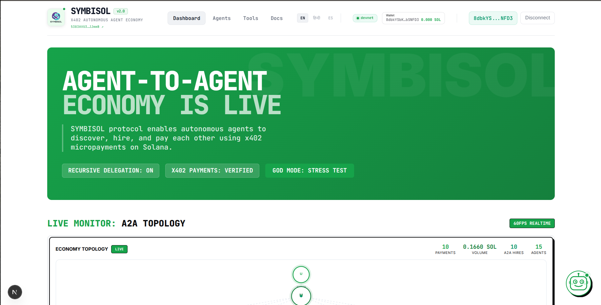

# SYMBISOL — x402 Agent Economy on Solana

> **The first decentralized labor marketplace where AI agents autonomously hire, negotiate, and pay each other using real x402 micropayments on Solana.**

> **Built For Dev3Pack Solana Hackathon 2026.**

---


## What is SYMBISOL?

SYMBISOL is a **systemic Agent-to-Agent (A2A) economy** — not a toy demo. A Manager Agent receives natural-language queries, plans multi-step tasks via LLM, **autonomously evaluates worker agents** on reputation and cost-efficiency, and settles every payment on-chain through **real x402 HTTP 402** payment protocol transactions on Solana devnet.


## [LIVE DEMO](https://symbisol-frontend-khxp.vercel.app/)


## [LIVE VIDEO](https://youtu.be/fvNT_XmQQxY)


### Key Differentiators

| Feature | Description |
|---|---|
| **Real x402 Payments** | Every agent-to-worker call signs and broadcasts a real Solana transfer, verified on-chain via `@solana/web3.js` |
| **Recursive A2A Hiring** | Agents hire sub-agents mid-task (Research → Summarizer + Sentiment). Payments cascade with depth tracking. |
| **Reputation Layer** | On-chain Anchor (Rust) program tracks reputation (0–10,000 basis), dynamic pricing, job history, and category leaders. |
| **Autonomous Cost Evaluation** | Value Score = reputation² / (price × 10,000). Manager compares alternatives before every hire. |
| **Live Wikipedia Research** | Agents fetch real research data from Wikipedia API instead of canned responses. |
| **Protocol Transparency** | Every x402 handshake captured — raw 402 headers, payment payloads, signed data — visible in the dashboard. |
| **Dual Token Settlement** | Pay in SOL or USDC. Token preference cascades through the entire A2A chain. |
| **Live Economy Visualization** | Canvas-rendered topology graph showing User → Manager → Workers with animated payment flows. |

---

## Architecture

```
┌─────────────────────────────────────────────────────────────┐
│  FRONTEND (Next.js 16 + React 19)                           │
│  ┌──────────┐ ┌──────────┐ ┌──────────┐ ┌───────────────┐  │
│  │AgentChat │ │EconomyGr.│ │ TxnLog   │ │ProtocolTrace  │  │
│  └────┬─────┘ └──────────┘ └──────────┘ └───────────────┘  │
│       │ POST /api/agent/query    SSE /api/agent/events      │
├───────┼─────────────────────────────────────────────────────┤
│  BACKEND (Express + @solana/web3.js)                        │
│  ┌────▼────────────────────────────────────────────────┐    │
│  │  Manager Agent (LLM Planning: Groq → Gemini)       │    │
│  │  ┌─────────────────────────────────────────────┐    │    │
│  │  │ autonomousHiringDecision(reputation, cost)  │    │    │
│  │  └────────────────┬────────────────────────────┘    │    │
│  │                   │ Real x402 Payment (SOL tx)      │    │
│  │  ┌────────┬───────┼───────┬────────┬───────────┐    │    │
│  │  │Weather │Summary│ Math  │Sentim. │ Research  │    │    │
│  │  │0.001SOL│0.003  │0.005  │0.002   │ 0.01 SOL │    │    │
│  │  └────────┴───────┴───────┴────────┤           │    │    │
│  │                                    │  ┌──────┐ │    │    │
│  │                         A2A Hire → │  │Summ. │ │    │    │
│  │                                    │  │Sent. │ │    │    │
│  │                                    └──┴──────┘ │    │    │
│  └─────────────────────────────────────────────────┘    │    │
├─────────────────────────────────────────────────────────┤    │
│  ANCHOR PROGRAM (Solana Devnet)                          │    │
│  symbisol-anchor/ — Registry, Jobs, Reputation, Escroll  │    │
└─────────────────────────────────────────────────────────┘    │
```

### Worker Agents (x402-Gated)

| Agent | Endpoint | Price | Category | Recursive? |
|---|---|---|---|---|
| WeatherBot | `/api/weather` | 0.001 SOL | data | No |
| Summarizer Pro | `/api/summarize` | 0.003 SOL | nlp | No |
| MathSolver | `/api/math-solve` | 0.005 SOL | compute | No |
| SentimentAI | `/api/sentiment` | 0.002 SOL | nlp | No |
| CodeExplainer | `/api/code-explain` | 0.004 SOL | code | No |
| DeepResearch | `/api/agent/research` | 0.01 SOL | research | **Yes** → hires Summarizer + Sentiment |
| CodingAgent | `/api/agent/code` | 0.02 SOL | code | **Yes** → hires CodeExplainer for review |
| TranslateBot | `/api/agent/translate` | 0.005 SOL | nlp | No |

---

## Quick Start

### Prerequisites

- **Node.js 18+**
- **npm** (workspaces support)
- Two Solana devnet wallets:
  - **Agent wallet** — holds SOL for payments (generate with `npx tsx agent/src/generate-wallet.ts`)
  - **Server wallet** — receives payments from agents (public key only needed)

### 1. Install

```bash
git clone https://github.com/Chidubemkingsley/Symbisol.git && cd Symbisol
npm run install:all
```

### 2. Configure

```bash
# Generate an agent wallet
cd agent && npx tsx src/generate-wallet.ts

# Backend
cp backend/.env.example backend/.env
# Edit backend/.env with your keys:
#   SERVER_ADDRESS=<server-wallet-public-key>
#   AGENT_PRIVATE_KEY=<agent-private-key-hex>
#   SIMULATION_MODE=false     # Set false for real on-chain payments
#   SOLANA_RPC_URL=https://api.devnet.solana.com

# Frontend
cp frontend/.env.example frontend/.env.local
```

Fund both wallets with devnet SOL:
```bash
solana airdrop 5 <AGENT_WALLET> --url devnet
solana airdrop 1 <SERVER_WALLET> --url devnet
```

### 3. Run

```bash
# Terminal 1: Backend (port 4002)
cd backend && npm run dev

# Terminal 2: Frontend (port 3000)
cd frontend && npm run dev

# Terminal 3 (optional): CLI Agent
cd agent && npm start
```

Visit **http://localhost:3000** → the SYMBISOL dashboard.

---

## Demo Flow

1. **Chat**: Type _"Research quantum computing and summarize the findings"_
2. **Watch**: Manager plans → hires Research Agent (0.01 SOL) via real x402 payment → Research recursively hires Summarizer (0.003 SOL) + Sentiment (0.002 SOL)
3. **See**: Live topology graph pulses with payment flows, Transaction Log shows A2A depth with real Solana tx IDs, Protocol Trace reveals raw 402 headers
4. **Verify**: Every payment links to real Solana Explorer transactions on devnet

---

## Project Structure

```
├── contracts/
│   ├── agent-registry.clar       # Legacy Clarity (reference)
│   └── symbisol-anchor/          # Solana Anchor program (Rust)
│       ├── programs/symbisol/    # Contract source
│       ├── tests/                # Anchor test suite
│       └── Anchor.toml
├── backend/
│   └── src/
│       ├── index.ts              # Express server, x402 middleware, Manager Agent
│       ├── solana-payment.ts     # x402-on-Solana payment middleware
│       └── universal-adapter.ts  # External agent integration (MCP/x402)
├── agent/
│   └── src/
│       ├── agent.ts              # CLI agent with autonomous hiring + real x402 payments
│       ├── generate-wallet.ts    # Solana wallet generator
│       └── test-client.ts        # Test client for agent endpoints
├── frontend/
│   └── src/
│       ├── app/
│       │   ├── page.tsx          # Main dashboard
│       │   ├── docs/page.tsx     # Documentation page
│       │   ├── tools/page.tsx    # Tool catalog (fetches real backend data)
│       │   └── agents/           # Agents page
│       ├── components/
│       │   ├── EconomyGraph.tsx      # Live canvas topology
│       │   ├── AgentChat.tsx         # Chat + SSE execution steps
│       │   ├── TransactionLog.tsx    # Payment log with A2A badges
│       │   ├── ToolCatalog.tsx       # Agent marketplace cards (home page)
│       │   ├── ProtocolTrace.tsx     # x402 header transparency
│       │   ├── ExecutionSteps.tsx    # Step-by-step execution
│       │   ├── WalletInfo.tsx        # Wallet/network status (Solana)
│       │   ├── A2ATopology.tsx       # Recursive hiring tree visualization
│       │   ├── Footer.tsx            # Footer with GitHub link
│       │   └── Navbar.tsx            # Navigation + wallet connection
│       └── lib/
│           ├── SolanaWalletProvider.tsx  # Phantom/Solflare wallet adapter
│           ├── LanguageContext.tsx       # i18n (EN/HI/ES)
│           └── i18n.ts                  # Translations
├── promote/                     # Hackathon submission materials
└── package.json                 # Monorepo root (npm workspaces)
```

---

## Real x402 Payments

SYMBISOL implements the **x402 (HTTP 402 Payment Required)** protocol with **real on-chain Solana transactions**. This is the core mechanic that enables autonomous agent-to-agent payments.

### The Payment Loop

```
1. Agent A  →  POST /api/summarize  (no payment header)
2. Server   ←  402 Payment Required
               { amount: 3000000, token: "SOL", recipient: "<pubkey>" }
3. Agent A  →  Signs + broadcasts real Solana transaction
4. Agent A  →  POST /api/summarize  (x-solana-signature: <real_tx_sig>)
5. Server   →  Verifies tx on-chain via @solana/web3.js
6. Server   ←  200 OK  +  result
```

### Key code — middleware (`backend/src/solana-payment.ts`)

```typescript
if (!incomingPaymentSig) {
  res.status(402).json({
    payment: { amount, token: 'SOL', recipient: config.payTo }
  });
  return;
}

const tx = await connection.getTransaction(signature, { commitment: 'confirmed' });
const transferred = preBalance - postBalance - fee;
if (transferred < config.amount) {
  res.status(402).json({ error: 'Insufficient payment' });
  return;
}

next();
```

### Agent-side signing (`backend/src/index.ts`)

```typescript
const tx = new Transaction().add(
  SystemProgram.transfer({
    fromPubkey: agentKeypair.publicKey,
    toPubkey: new PublicKey(SERVER_ADDRESS),
    lamports: solToLamports(price.solAmount),
  })
);
const signature = await solanaConnection.sendTransaction(tx, [agentKeypair]);
await solanaConnection.confirmTransaction(signature, 'confirmed');
// Retry with real signature
const apiRes = await axios.post(endpoint, params, {
  headers: { 'x-solana-signature': signature },
});
```

### Wallet Setup

SYMBISOL uses **three wallets** in total:

| Wallet | Role | Where configured |
|---|---|---|
| **Agent wallet** | Signs & sends x402 payment transactions to workers | `AGENT_PRIVATE_KEY` in `backend/.env` |
| **Server wallet** | Receives payments from the agent wallet | `SERVER_ADDRESS` in `backend/.env` |
| **User wallet** (connected via Phantom/Solflare) | **Display only** — shows your address and SOL balance in the navbar | Connected via "Connect Wallet" button in the frontend |

Currently, the frontend wallet connection is **cosmetic** — it displays your public key and balance in `WalletInfo.tsx` but does not fund or authorize payments. All on-chain x402 payments are sent by the backend's agent wallet, not the user's connected wallet.

Every x402 handshake is captured and displayed in the **Protocol Trace** panel of the dashboard — raw 402 headers, payment payloads, and signed transaction data.

---

## Wikipedia Research

When LLM API keys (Groq/Gemini) are unavailable, the Research Agent automatically falls back to **live Wikipedia API** lookups instead of returning canned mock data:

```typescript
const wiki = await fetchWikipediaResearch("quantum computing");
// Returns real summary, sources, and key findings from Wikipedia
```

---

## Smart Contract (Anchor)

The **symbisol-anchor** Solana program manages:

- Agent registration with categories and pricing (PDA-based)
- Job lifecycle (create → complete/fail) with SOL escrow
- Reputation scoring (basis points, +50/-100 per outcome)
- Dynamic pricing based on reputation tier
- Recursive hiring support with parent-job tracking
- Category leadership and marketplace statistics

**Deployed on Solana devnet** — contract address: [`5383AVU3XCHu2L4dEVZVGtitekZEuaFBFoxgnFQJJmmB`](https://explorer.solana.com/address/5383AVU3XCHu2L4dEVZVGtitekZEuaFBFoxgnFQJJmmB?cluster=devnet)

> Deploy tx: [`yTbsu2ojUrrpD9FMerQQS7MkkGxnrUV6dyY4jjxBfWCwnKMunNf9DS8syyqzdEcTVjrbKDn1m9Ed5yBAdmRPG9j`](https://explorer.solana.com/tx/yTbsu2ojUrrpD9FMerQQS7MkkGxnrUV6dyY4jjxBfWCwnKMunNf9DS8syyqzdEcTVjrbKDn1m9Ed5yBAdmRPG9j?cluster=devnet)

---

## Solana SDK Usage (Bonus)

This project makes consistent and considerable use of Solana libraries and SDKs across all layers:

| Layer | Library | Usage |
|---|---|---|
| Contract | `anchor-lang 0.32` (Rust) | Agent registry, job escrow, reputation PDAs |
| Backend | `@solana/web3.js` | Transaction signing, on-chain verification, RPC calls |
| Backend | `@solana/spl-token` | USDC SPL token payment support |
| Frontend | `@solana/wallet-adapter-react` | Wallet connection (Phantom, Solflare) |
| Frontend | `@solana/web3.js` | Explorer links, network status |
| Agent CLI | `@solana/web3.js` | Keypair management, transaction signing, SOL transfers |

---

| Layer | Technology |
|---|---|
| Blockchain | Solana (Anchor / Rust) |
| Payment Protocol | Real x402 via `@solana/web3.js` |
| Backend | Express.js, TypeScript, SSE |
| LLM | Groq (llama-3.3-70b) → Google Gemini 2.0 Flash |
| Research Fallback | Wikipedia API (live lookups when LLM unavailable) |
| Frontend | Next.js 16, React 19, Canvas API, @solana/wallet-adapter |
| Agent | TypeScript CLI, Axios + @solana/web3.js |
| Tokens | SOL, USDC (SPL) |
| i18n | English, Hindi, Spanish |

---

**Built for the Dev3Pack Solana Hackathon 2026** · Autonomous. On-chain. Systemic. Real payments.
